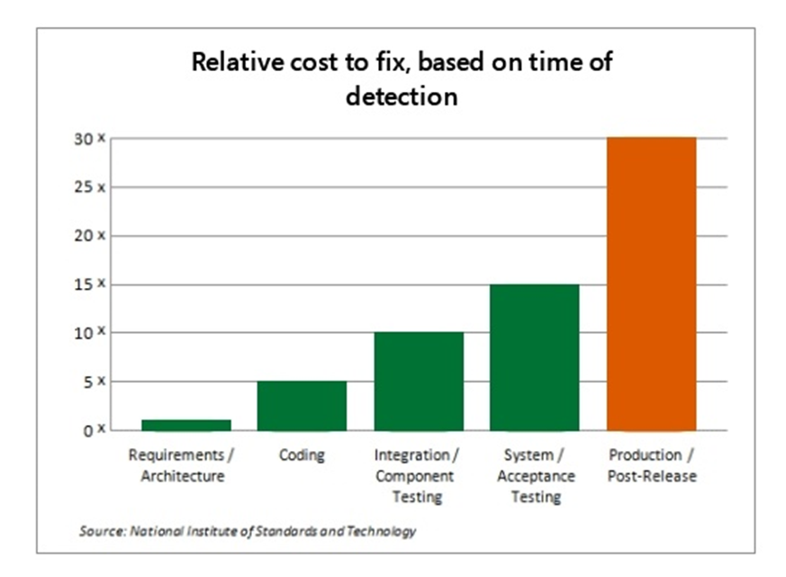
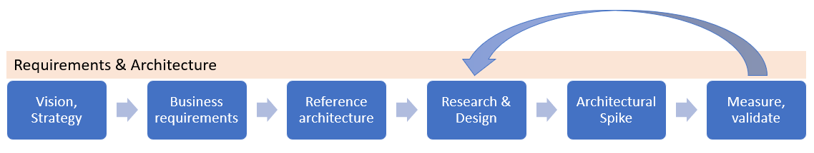

# Architecture in the cloud

> **[prev]** | **[home]**  | **[next]**

Solution architecture is concerned with the planning, design, implementation, and ongoing improvement of a technology system. The architecture of a system must balance and align the business requirements with the technical capabilities that are needed to execute those requirements. The finished architecture is a balance of risk, cost, and capability throughout the system and its components.

## The role of the Architect

A Solution Architect is someone who assists teams to design solutions that are fit for purpose. In the cloud this role is known as a "Cloud solution architect". In many teams Architect is a role, not a job title. It's important that every engineer learns cloud architecture patterns and practices.

## Do we need Architects in Agile?

While some teams have decided that having a dedicated Architect role is unnecessary, the need for good _architecture_ remains; in fact it is crucial for Agile teams that want to move fast, but still meet important business requirements around reliability, performance, operational excellence, cost and security. One approach for Agile teams is for all engineers to share the role of architect, putting on their "architect hat" from time to time. Another approach is to have an Architect available to the team as an _advisor_. **Microsoft FastTrack for Azure** engineers are often used in this capacity.

## Relative cost to fix and shift left

NIST conducted a study in 20021 concluding that the relative cost to fix of software defects increased exponentially the later they were discovered in the development process. The impact of _"shifting left"_ the discovery of defects to the **Requirements / Architecture** phase can be great, with this example showing a 30X saving in cost-to-fix compared to detecting the same defect in Production / Post-Release.

  _Figure: Example of relative cost to fix, based on time of detection, with effect of "shift left" highlighted._

## Azure Well-Architected Framework pillars

The Azure Well-Architected Framework consists of five pillars:

* Cost optimization
* Operational excellence
* Performance efficiency
* Reliability
* Security

> 📖 Read more in [Azure Well-Architected Framework pillars] (Microsoft Learn)

## Architecture design

Good practices in the design phase help to reduce issues in later phases of a system's life. While it is important to think about requirements in the early stage we should be careful not to fall into the trap of [Big Design Up Front] (BDUF); our design should evolve and continue to be refined until the end of the system's life. In the [reliability] section we will learn why business requirements are critical to good design, and can simplify the design process. This will be a recurring theme throughout this 1:many session.

An _architecture design session_ is a good way to kick-off a project. A small team of architects, engineers and product owners would meet to whiteboard a design, or to review a _candidate architecture_ that has already been researched and designed by a Solution architect. When critiquing a design the _vision_, _strategy_ and _business requirements_ should be kept firmly in mind. A _reference architecture_ may be used as a starting point.  

  _Figure: Example of an Architectural design process._

> 💡 A Microsoft Cloud Solution Architect (CSA) is a good resource for the envisioning and design phase of a Cloud Architecture design in Azure. Contact your Microsoft Account Team to request assistance from a CSA.

Once a candidate architecture has been formed it should be documented in a diagram. An _architectural spike_ may be performed to validate assumptions. Detailed _research and design_ of each component should be undertaken. For example, it is vital that architects understand the limits of the services and components that are being used.

> 📖 [Azure subscription and service limits, quotas, and constraints]

## Architecture review

Once a candidate architecture has been formed and the team are getting close to starting Dev/Test, we recommend requesting an Architecture Review from the FastTrack for Azure team. In a 90 minute review session we will review your design to validate that it meets your business requirements and offer advice (including a list of recommendations and risks) where we see room for improvements. The goal of a FastTrack for Azure Architecture review is to help you be successful in your deployment to Azure and also to have a great experience once your are operating your system in production.

> 📖 [FastTrack for Azure Architectural / Solution Review and Guidance Framework]

## Note on existing systems

Often when moving an existing system from on-premises to the cloud (often refered to as application modernisation) there will be several constraints placed on the future state architecture because of the current state architecture. When this occurs you may not be able to follow all of the guidance discussed.

* Often requirements are no longer known
* Old protocols and architecture inflexible
* Complex systems take time to change and will need a phased approach
* "Phase 1" may simply involve substituting out components for similar PaaS services
* Investing in building API facades for legacy components to facilitate integration (_[anti-corruption layer]_)

### Draw a Roadmap

Migration and modernization projects are common in cloud. Rarely do systems go from current state to future state in one big bang. What is more common is a series of steps and milestones ([improvement kata]) on a roadmap towards deploying the future state architecture. We recommend breaking your project down into a series of milestones, each one delivering value to the business.

## Requirements, requirements, requirements

Running a solution in the cloud doesn't reduce the need for requirements to be clear. In fact, the flexibility and power provided by the cloud means that it's even more important to have clear requirements from business stakeholders; otherwise, you could end up solving for problems that don't exist, missing an important design decision, or going beyond the available budget by adding unnecessary resiliency.

### Non-functional requirements (NFRs)

Below is a short-list of NFRs (not exhaustive) that may be provided by the business to help inform the design of a solution.

#### [Reliability requirements]

* Service level agreement (SLA)
* Uptime objective
* Recovery time objective (RTO)
* Recovery point objective (RPO)

#### [Security requirements]

* Geographical location
* Compliance and legislation
* Identity and access management
* Privacy
* Public or private endpoints (or both)
* OWASP
* Hybrid connectivity
* DDOS

#### Performance requirements

* Peak throughput, e.g. Requests per minute (RPM), active users
* Business plan for growth
* UX metrics (e.g. Page load time)
* Asynchronous vs Synchronous operations
* Workload profile (predictable, unpredictable, peak time of day)
* Data estate size and growth rate
* Time-to-live (TTL) of reports and views (realtime vs eventual consistency)

#### Operational requirements

* Prod and non-prod environments (Dev/Test, QA, Pre-prod, Prod)
* Release frequency (hours / days / months)
* Time to onboard (new customer)

#### Cost optimization

* Cost per user
* Target hosting costs as percentage of revenue
* Pricing model
* Tenancy model

## Azure SLAs

> 📖 Familiarize yourself with [Azure service-level agreements].

> 📺 Watch [SLIs, SLOs, SLAs, oh my!] for a definition of these terms and an explanation of the differences.

* An Azure Service-level Agreement (SLA) can also be read as a minimum service-level objective (SLO).
* An SLA is a financial guarantee, not an absolute guarantee
* Read the SLA details carefully, particularly the definition of "downtime" for each service, which give important hints about _failure modes_

For example, in the [SLA for Azure SQL Database], "downtime" is defined as:

_"The total accumulated Deployment Minutes across all Databases in a given Microsoft Azure subscription during which the Database is unavailable. A minute is considered unavailable for a given Database if **all continuous attempts by Customer to establish a connection to the Database** within the minute fail."_

The Azure SQL Database team expect almost all outages to be transient (brief and non-recurring). Therefore the _retry_ pattern should be used to continuously retry for up to a minute. This is typical in cloud services; retry has been the default behaviour in ADO.NET since .NET Framework 4.6.1.

## Links and references

1. [The Economic Impacts of Inadequate Infrastructure for Software] (PDF)

> **[prev]** | **[home]**  | **[next]**

[prev]:./azure-architecture-center.md
[home]:/README.md
[next]:./cloud-fundamentals.md
[Big Design Up Front]:https://en.wikipedia.org/wiki/Big_Design_Up_Front
[Azure Well-Architected Framework pillars]:https://docs.microsoft.com/en-us/learn/modules/azure-well-architected-introduction/2-pillars
[Azure subscription and service limits, quotas, and constraints]:https://docs.microsoft.com/en-us/azure/azure-resource-manager/management/azure-subscription-service-limits
[FastTrack for Azure Architectural / Solution Review and Guidance Framework]:https://github.com/Azure/fta-architecturalreview/blob/master/articles/introduction.md
[The Economic Impacts of Inadequate Infrastructure for Software]:https://www.nist.gov/system/files/documents/director/planning/report02-3.pdf
[anti-corruption layer]:https://docs.microsoft.com/en-us/azure/architecture/patterns/anti-corruption-layer
[improvement kata]:https://en.wikipedia.org/wiki/Toyota_Kata#The_Improvement_Kata
[SLIs, SLOs, SLAs, oh my!]:https://www.youtube.com/watch?v=tEylFyxbDLE
[SLA for Azure SQL Database]:https://azure.microsoft.com/en-au/support/legal/sla/sql-database/v1_4/
[Azure Service-level Agreements]:https://azure.microsoft.com/en-au/support/legal/sla/
[Reliability requirements]:https://docs.microsoft.com/en-gb/azure/architecture/framework/resiliency/overview#define-requirements
[Cost requirements]:https://docs.microsoft.com/en-gb/azure/architecture/framework/cost/design-capture-requirements
[Security requirements]:https://docs.microsoft.com/en-gb/azure/architecture/framework/security/governance