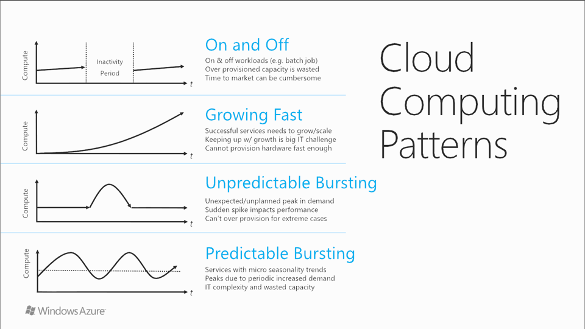

# Cloud fundamentals

> **[prev]** | **[home]**  | **[next]**

Digital transformation has driven incredible demand for services and the servers that host them. The
cloud is essentially a solution to problems of economics and scale in server hosting. As a result of
the change in scale, we need to design and architect our systems specifically so that we can make
the most of the infrastructure available.

The cloud has changed the way we think about architecting solutions. Cloud providers like Azure have
enormous pools of compute resources and storage, vast global networks, and handle a significant
amount of the administrative and management burden for you. There are a few principles you should
think about as you design your solution so that you can get the most out of being in the cloud.

## Economics of the cloud

In traditional models of server hosting, we typically maintained corporate server rooms and small
data centres to house our infrastructure. Equipment was procured, installed, and then operated for
a fixed lifetime - usually three to five years - before being decommissioned and replaced. This
required capital expenditure of fixed cost, and the asset values depreciated over time. Traditional
hosting models also favoured manual operations and often had fairly relaxed security.

Virtualisation helped to get more efficient use of our infrastructure, since we could provision
capacity and spread it across multiple workloads. But for most companies it was challenging to
achieve optimal density of VMs to hosts due to the [knapsack problem]. Scaling VMs up often requires
even more infrastructure to be provisioned.

The cloud is essentially a hyperscale virtualisation environment. Cloud regions (comprised of
multiple datacentres) can host millions of cores and petabytes of RAM and storage. As there are so
many resources available, the law of large numbers dictates that we can achieve better density and
can generally have a much better chance of fulfilling scale requests. The economies of scale also
mean that the average marginal cost (of additional CPU/RAM/storage) can often be much lower in the
cloud.

### Relative cost of resources

Different types of resources have very different pricing models. Consider four common types of
resources used in many cloud-hosted applications:

* Network traffic. Azure typically does not charge for traffic entering our regions (ingress) but
  does charge for traffic as it leaves (egresses) our regions.
* Storage. There are a number of different storage options for different storage profiles.
* Compute. There are a large number of options for types of VMs available depending on the feature
  set and resource profile required.
* A SQL database, which includes storage, compute, and networking as part of its implementation.

We can compare the relative costs of some entry-level resource profiles for each of these resource
types:

 _Figure: Relative cost (approximate)
of resources in Azure._

These prices are not expensive in absolute terms, but the explicit pricing models mean that we can
track our expenditure on different resources and ensure we are using them as efficiently as
possible.

This is particularly important when we operate at high scale. Large software vendors (e.g.
Microsoft, Google, and Facebook) make use of architectures and patterns that favour less expensive
resources while still achieving massive scale. We can use similar practices to optimise the
selection of technologies to suit the cloud pricing models.

> 📖 Read more in [Azure Well-Architected Framework - Maximize efficiency of cloud spend].

### Cloud models

TODO
Self-managed vs. managed, IaaS/PaaS/serverless
Consider the TCO - the cloud vendor is taking a lot of the work away from you

## Elasticity

There are a number of workload patterns that make the best use of the economics and scale of the
cloud:

* **On and off:** some workloads only need to run for a small amount of time, such as batch jobs.
  Provisioning dedicated infrastructure just for these is wasteful when the infrastructure is only
  used intermittently.
* **Growing fast:** workloads that scale up as the business grows will require more and more
  infrastructure to run them. Without the cloud, it can be very hard to provision new hardware fast
  enough to keep up with growing demand.
* **Unpredictable bursting:** some workloads have unpredictable or unplanned burst in demand, such
  as when a celebrity endorses a product on Twitter. Sudden spikes in load can impact performance
  for everyone, and since the bursting is unpredictable we need the elasticity of the cloud in order
  to rapidly provision new resources.
* **Predictable bursting:** even when a workload's bursting is predictable and planned, such as
  daily or seasonal peaks in traffic, it can be challenging to provision enough capacity for those
  times while not wasting resources the rest of the time. The elasticity of the cloud allows for the
  necessary resources to be provisioned when needed and then deprovisioned.

 _Figure: Common workload
patterns for the cloud._

Each of these take advantage of **elasticity** - the ability to rapidly provision new resources.
The large pool of resources made available by cloud providers means that new resources can be
provisioned when they are required, used for as long as they are needed, and then deprovisioned.

By taking advantage of elasticity you can keep your costs low initially as you build out your
user base, while also rapidly responding to an influx of traffic or activity.

To make the most of the elasticity provided by the cloud there are a few things you can do such as:
* Prefer stateless applications wherever possible, so that you can rapidly shift your traffic
  around and don't have to pin specific requests to specific compute instances.
* Avoid having bottlenecks that might inhibit your ability to scale out quickly.
* Loosely couple your components so that you can scale each part of your solution independently.
* Configure [auto-scaling] on your resources so that you can quickly scale even with unpredictable
  bursting.

> 📖 Read more in [Azure Architecture Guide - Design to scale out].

## Loose coupling
Any non-trivial solution will be made up of multiple components that work together. The
communication and coupling between these components matters a great deal.

Synchronous communication is often the simplest approach to implement. It also is typically very
performant, since messages are sent directly from point to point. This can be a good approach for
simpler systems, or for communicating between two parts of a solution that are highly
interdependent - for example, talking from an application to a database or cache.

However, in some situations tight coupling will lead to problems. Any downstream delays, failures,
or bottlenecks can cause your entire solution's performance to be degraded. Also, tight coupling
means that the sender needs to know the exact location to send a request to (e.g. an IP address,
port, or hostname). If we are using horizontal scaling in our solution then it can be difficult to
keep track of which compute nodes might currently be running the component we need to talk to.

Loose coupling, on the other hand, typically involves asynchronous communication. It often makes
use of message brokers like Service Bus. Instead of sending requests directly between systems, the
sender might instead sends a message to a broker and the destination system subscribes to the same
broker. Messages are delivered through the broker, and regardless of how many instances of the
sender or receiver there may be, the broker will handle reliable delivery to the correct recipients.
One example of this type of design is the [Web-Queue-Worker architecture style].

Another alternative, the [event-driven architecture style], can be used for components to publish
information about actions that have taken place into a central event store. Other components can
listen to the events coming from that store, and can decide independently when they might want to
take action.

Loose coupling has some important benefits for resiliency and elasticity.
* **Resiliency:** loose coupling means there is a buffer between your solution components to
  protect them one another's failures. This typically increases the resiliency of the overall solution.
* **Elasticity:** to achieve elastic scale, it helps to have loosely coupled components. Adding
  additional compute workers and removing unnecessary compute workers can be achieved without
  upstream systems needing to be aware of the scaling.

> 📖 Read more in [Application Architecture Guide - Minimize coordination].

## Eventual consistency

In traditional networks and environments, applications were typically built to expect their data stores to have _strong consistency_ - in other words, to have the most recent data available at all times, and for changes to data to be instantly persisted and available everywhere. This suited solutions that ran in a single data centre. However, cloud solutions can often require us to reconsider whether strong consistency is truly necessary.

In cloud environments, we need to consider both the consistency and the availability of our systems, as well as its performance and throughput. The [CAP theorem] states that high consistency and high availability need to be balanced against each other and that there is a trade-off between the two.

We may require our components to be networked across geographical regions, such as for high availability or disaster recovery. Connections between regions involve a certain amount of latency simply due to the speed of light. If we need to synchronise or replicate our data across the world, then strong consistency will require a significant amount of time to complete each transaction. Each transaction will need to synchronously update all of the replicas and wait for confirmation, which could be very slow and impact the overall throughput of our system.

Instead, consider whether _eventual consistency_ is possible. In an eventually consistent store, systems coordinate with each other and their data stores eventually will be consistent with one another; but for some period of time (usually seconds or a few minutes, but sometimes longer) they might be out of sync with recent changes from other systems. This can seem like a major problem, but in fact many workloads suit this pattern quite well.

Eventual consistency is also important for synchronising data between two different systems. For example, consider a sales system that replicates sales data out to a reporting system. If this is done in real-time and with strong consistency then the reporting system will always be completely accurate, but at the cost of strongly coupling the two systems together, and at a longer transaction time and reduced transaction throughput since transactions have to be committed by two different systems. In most scenarios, though, the sales data is actually not fully analysed for several minutes, or even until the next business day, and so the performance trade-offs of eventual consistency are justified.

Some architectural styles require the use of eventual consistency. For example, a microservices architecture or an event-driven architecture each involve independent systems, which typically have their own data stores and are designed specifically to prioritise loose coupling and high performance.

> 📖 Read more about data store selection for microservices architectures in the [Azure Architecture Center - Data considerations for microservices].

Even within more typical architectures, eventual consistency will still be a useful principle. For example:
* [Caching] typically involves a data store (a _cache_) maintaining a copy of data so that subsequent requests do not need to go back to the data store or application. The cache will often be refreshed at a defined interval, and changes that happen within that cached data interval may not be visible to consumers until the cache is refreshed.
* Geo-replication of data is almost always done asynchronously, and the secondary replicas will therefore be eventually consistent.
* Some data stores, such as Cosmos DB, support multi-region writes. These writes are synchronised across all of the regions that contain the database, but the synchronisation process is asynchronous and eventually consistent.

Many solutions need a mixture of consistency levels for different parts of their solution. For example, you might need strong consistency within a transactional system but eventual consistency for replicas across regions, or to synchronise data to an analytics system or third party. Some data stores, like Cosmos DB, let you control the consistency level at the transaction level to meet your requirements.

> 📖 Read more about data store and consistency level selection in [Application Architecture Guide - Use the best data store for the job].

[CAP theorem]:https://en.wikipedia.org/wiki/CAP_theorem
[Azure Architecture Center - Data considerations for microservices]:https://docs.microsoft.com/en-us/azure/architecture/microservices/design/data-considerations
[Caching]:https://docs.microsoft.com/en-us/azure/architecture/best-practices/caching#caching-and-eventual-consistency
[Application Architecture Guide - Use the best data store for the job]:https://docs.microsoft.com/en-us/azure/architecture/guide/design-principles/use-the-best-data-store

It's also important to recognise that eventual consistency, loose coupling, and elasticity are all interrelated:
* Loose coupling your components implies you need eventual consistency between those components.
* Elasticity is easier to achieve when your systems are loosely coupled.

## Partitioning

Sharding, partitioning, stamps
TODO scaling out usually cheaper than scaling up

? TODO
https://docs.microsoft.com/en-us/azure/architecture/guide/design-principles/partition
https://docs.microsoft.com/en-us/azure/architecture/best-practices/data-partitioning
https://docs.microsoft.com/en-us/azure/architecture/best-practices/data-partitioning-strategies

> **[prev]** | **[home]**  | **[next]**

[prev]:./requirements.md
[home]:/README.md
[next]:./cloud-design-patterns.md
[Knapsack problem]:https://en.wikipedia.org/wiki/Knapsack_problem
[Azure Well-Architected Framework - Maximize efficiency of cloud spend]:https://docs.microsoft.com/en-us/learn/modules/azure-well-architected-cost-optimization/5-maximize-efficiency-of-cloud-spend
[auto-scaling]: https://docs.microsoft.com/en-us/azure/architecture/best-practices/auto-scaling
[Azure Architecture Guide - Design to scale out]:https://docs.microsoft.com/en-us/azure/architecture/guide/design-principles/scale-out
[Application Architecture Guide - Minimize coordination]:https://docs.microsoft.com/en-us/azure/architecture/guide/design-principles/minimize-coordination
[Event-driven architecture style]:https://docs.microsoft.com/en-us/azure/architecture/guide/architecture-styles/event-driven
[Web-Queue-Worker architecture style]:https://docs.microsoft.com/en-us/azure/architecture/guide/architecture-styles/web-queue-worker
