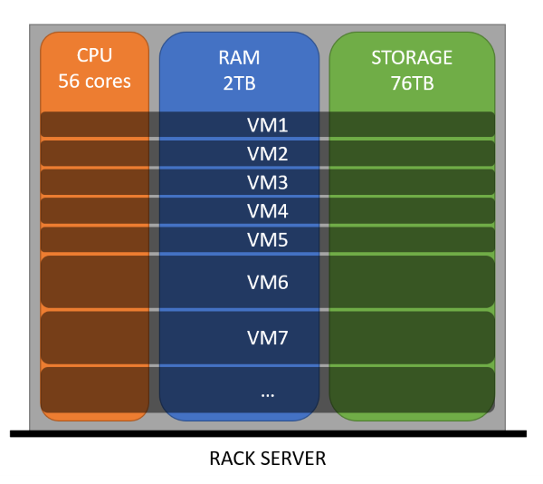
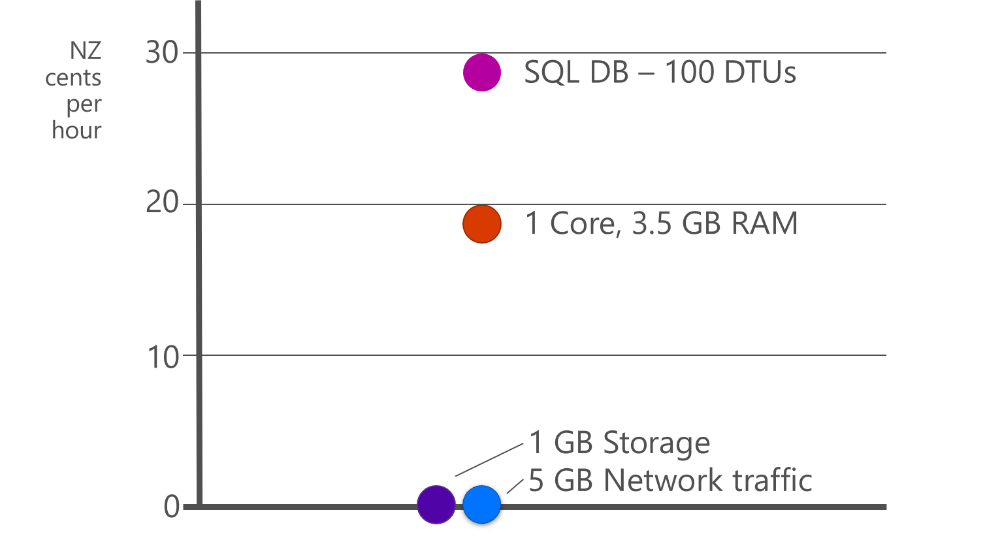
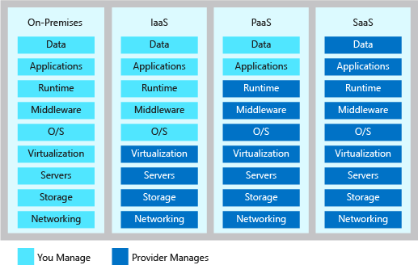

# Cloud fundamentals

> **[prev]** | **[home]**  | **[next]**

Digital transformation has driven incredible demand for services and the servers that host them. The
cloud is essentially a solution to problems of economics and scale in server hosting. As a result of
the change in scale, we need to design and architect our systems specifically so that we can make
the most of the infrastructure available.

The cloud has changed the way we think about architecting solutions. Cloud providers like Azure have
enormous pools of compute resources and storage, vast global networks, and handle a significant
amount of the administrative and management burden for you. There are a few principles you should
think about as you design your solution so that you can get the most out of being in the cloud.

> 📺 Watch the [Architecting Distributed Cloud Applications] video series for even even more
> detail on these concepts.

## Economics of the cloud

In traditional models of server hosting, we typically maintained corporate server rooms and small
data centres to house our infrastructure. Equipment was procured, installed, and then operated for
a fixed lifetime - usually three to five years - before being decommissioned and replaced. This
required capital expenditure of fixed cost, and the asset values depreciated over time. Traditional
hosting models also favoured manual operations and often had fairly relaxed security.

Virtualisation helped to get more efficient use of our infrastructure, since we could provision
capacity and spread it across multiple workloads. But for most companies it was challenging to
achieve optimal density of virtual machines (VMs) to hosts due to the [knapsack problem].
Scaling VMs up often requires even more infrastructure to be provisioned.

 _Figure: VM stacking._

The cloud is essentially a hyperscale virtualisation environment. Cloud regions (comprised of
multiple datacentres) can host millions of cores and petabytes of RAM and storage. As there are so
many resources available, the law of large numbers dictates that we can achieve better density and
can generally have a much better chance of fulfilling scale requests. The economies of scale also
mean that the average marginal cost (of additional CPU/RAM/storage) can often be much lower in the
cloud.

### Relative cost of resources

Different types of resources have very different pricing models. Consider four common types of
resources used in many cloud-hosted applications:

* **Network traffic.** Azure typically does not charge for traffic entering our data centres
  (_ingress_) but does charge for traffic as it leaves (_egresses_) our data centres.
* **Storage.** There are a number of different storage options for different storage profiles.
* **Memory.** We need to maintain some data in memory (RAM) for fast access.
* **Compute.** There are a large number of options for types of VMs available depending on the
  feature set and resource profile required.

We can compare the relative costs of some entry-level resource profiles for each of these resource
types:

 _Figure: Relative cost (approximate)
of resources in Azure._

These prices are not expensive in absolute terms, but the explicit pricing models mean that we can
track our expenditure on different resources and ensure we are using them as efficiently as
possible.

This is particularly important when we operate at high scale. Large software vendors (e.g.
Microsoft, Google, and Facebook) make use of architectures and patterns that favour less expensive
resources while still achieving massive scale. We can use similar practices to optimise the
selection of technologies to suit the cloud pricing models.

> 📖 Read more in [Azure Well-Architected Framework - Maximize efficiency of cloud spend].

> ### 🧩 Design pattern: Static Content Hosting
> 
> The relative cost of storage is much lower than that of compute resources. One way to exploit this
> is to move static content into a storage system, or to use caching (e.g. Azure CDN) to store and
> re-serve data that does not change frequently. This is also a great way to increase the
> performance of an application by serving it from resources that are geographically closer to
> users, and by offloading the processing of these requests to dedicated services that are optimised
> for this task.
> 
> 📖 Read the full [Static Content Hosting pattern].

## Cloud models

Consider different cloud hosting models. Managed services (also called Platform as a Service/PaaS,
serverless, or Software as a Service) usually have much less ongoing maintenance and operation 
required compared to unmanaged services (Infrastructure as a Service). Managed services often
result in a lower total cost of ownership (TCO).

> 📖 Read more in [Azure Well-Architected Framework - Managed services].

### Shared responsibility

Moving to the cloud introduces a model of [shared responsibility]. In this model, your cloud
provider will manage certain aspects of your application, leaving you with the remaining
responsibility. Depending on the model your services use, you will have different levels and types
of responsibility.

In this model Microsoft Azure take a large part of the responsibility for reliability for PaaS,
but not all. Customers also have responsibilities in this model, which we will discuss as we go.

## Elasticity

There are a number of workload patterns that make the best use of the economics and scale of the
cloud. These all make use of the cloud's **elasticity**. The large pool of resources made available
by cloud providers means that new resources can be provisioned right when they are required, used
for as long as they are needed, and then deprovisioned.

> 📖 Read more in [Azure Well-Architected Framework - Maximize efficiency of cloud spend].

By taking advantage of elasticity you can keep your costs low initially as you build out your
user base, while also rapidly responding to an influx of traffic or activity.

To make the most of the elasticity provided by the cloud there are a few things you can do such as:
* Prefer scaling out rather than scaling up.
* Prefer stateless applications wherever possible, so that you can rapidly shift your traffic
  around and don't have to pin specific requests to specific compute instances.
* Avoid having bottlenecks that might inhibit your ability to scale out quickly.
* Configure auto-scaling on your resources so that you can quickly scale even with unpredictable
  bursting.
* Loosely couple your components so that you can scale each part of your solution independently.

> 📖 Read more in [Azure Well-Architected Framework - Scaling up and scaling out],
> [Application Architecture Guide - Design to scale out], and
> [Application Architecture Guide - Autoscaling].

## Loose coupling

Any non-trivial solution will be made up of multiple components that work together. The
communication and coupling between these components matters a great deal. In cloud architecture
we prefer components that are loosely coupled, and that don't have strong dependencies on one
another. This helps to improve:

* **Resiliency:** loose coupling means there is a buffer between your solution components to
  protect them one another's failures. This typically increases the resiliency of the overall
  solution.
* **Elasticity:** to achieve elastic scale, it helps to have loosely coupled components. Adding
  additional compute workers and removing unnecessary compute workers can be achieved without
  upstream systems needing to be aware of the scaling.

There are some key approaches that we use in the cloud to take advantage of loose coupling.

One approach is to use request queuing and batching.  This can be done as the basis of a whole
solution's design (e.g. the [web-queue-worker architecture style]), or you can adopt queues at
strategic points within any architecture.

> 📖 Read more about queuing in 
> [Azure Well-Architected Framework - App design for performance efficiency].

> ### 🧩 Design pattern: Async Request-Reply
> 
> Avoid having frontend hosts performing long-running tasks. Instead, have the frontend host
> initiate a background processor to complete the task, and allow the client to obtain the status of
> the task.
> 
> 📖 Read the full [Async Request-Reply pattern].

> ### 🧩 Design pattern: Publisher-Subscriber
> 
> Have application components publish messages into a message broker (often a queue, but not
> necessarily). Consumers then subscribe to that broker and receive messages as they are available.
> 
> 📖 Read the full [Publisher-Subscriber pattern].

> ### 🧩 Design pattern: Queue-based Load Leveling
> 
> Once a queue is employed (e.g. as per the [Publisher-Subscriber pattern]), the system processing
> messages from the queue can process at a consistent rate. This supports elastic scaling since new
> workers can be provisioned and deprovisioned based on queue length.
> 
> 📖 Read the full [Queue-based Load Leveling pattern].

> ### 🧩 Design pattern: Competing Consumers
> 
> Multiple workers can subscribe to a single queue. They 'compete' for messages, letting the queue
> deliver messages to each one, and can obtain further messages as they complete the processing of
> each message. This helps to balance the workload between workers.
> 
> 📖 Read the full [Competing Consumers pattern].

Another approach for a loosely coupled solution architecture is the
[Event-driven architecture style]. In these architectures, subcomponents or microservices publish
events, and other parts of the system listen to those events and perform their own actions
independently.

> 📖 Read more in the [Azure Well-Architected Framework - Performance efficiency pillar] and 
> [Application Architecture Guide - Minimize coordination].

## Eventual consistency

When designing a cloud solution, consider whether _eventual consistency_ is possible. In an
eventually consistent data store, copies of the data become consistent over time, but for some
period they might be out of sync with recent changes from other systems.

Eventual consistency can minimise the need for locks, which means your application can typically
support a higher request throughput.

> 📖 Read more about data locking in 
> [Azure Well-Architected Framework - App design for performance efficiency].

It also means that you can replicate your data out to another availability zone or region.
Networking introduces delays, and it is more efficient for a background process to synchronise your
data stores than to perform transactional writes across regions. This is very important when using
a database like Cosmos DB, which supports multi-region writes.

By taking advantage of eventual consistency you can also make use of caching, which can help to
avoid unnecessary queries and operations against your data stores. Caching can be done within your
application or at the network edge using a CDN.

> 📖 Read more about caching in [Azure Architecture Center - Caching best practice] and
> [Azure Well-Architected Framework - Use a CDN].

Many solutions need a mixture of consistency levels for different parts of their solution. For
example, you might need strong consistency within a transactional system but eventual consistency
for replicas across regions, or to synchronise data to an analytics system or third party. Having
clear requirements from business stakeholders is critical to making an informed decision on
consistency levels. Some data stores, like Cosmos DB, even let you control the consistency level for
individual transactions, which can help to meet more complex requirements.

 _Figure: Consistency
levels in Cosmos DB_

> 📖 Read more about data store and consistency level selection in
> [Application Architecture Guide - Use the best data store for the job].

Some architectural styles require the use of eventual consistency. For example, a microservices
architecture or an event-driven architecture each involve independent systems, which typically have
their own data stores and are designed specifically to prioritise loose coupling and high
performance.

> 📖 Read more about data store selection for microservices architectures in the
> [Azure Architecture Center - Data considerations for microservices].

> ### 🧩 Design pattern: Choreography
> 
> Have multiple systems independently perform operations based on messages or events. Instead of
> having a single controller orchestrating everything, have each sub-component or microservice make
> its own decisions and perform its own operations. Each independent system may be processing data at
> different rates, and therefore may not have strong consistency with one another.
> 
> 📖 Read the full [Choreography pattern].

> ### 🧩 Design pattern: Compensating Transactions
> 
> Eventually consistent systems can make it difficult or impossible to roll back failed transactions.
> Instead, implement a transaction that undoes the effect of the failed transaction while taking
> account of any subsequent actions that may have taken place.
> 
> 📖 Read the full [Compensating Transactions pattern].

## Partitioning

A further key principle of designing solutions for the cloud is partitioning. Each partition
represents a distinct set of data or compute resources that can be managed and accessed separately.
Partitioning is frequently used for high-volume solutions to allow different sets of physical
infrastructure to independently manage subsets of the total data set, and to perform querying and
compute operations on that data independently of other partitions. Some data stores (e.g. Cosmos DB)
perform partitioning automatically, while others (e.g. SQL Server) need you to configure this
explicitly.

> ### 🧩 Design pattern: Sharding
> 
> Divide data sources into horizontal partitions (shards) and store them in distinct databases or
> stores. This enables high levels of scale-out across independent sets of compute and storage
> resources.
>
>  _Figure: Sharding example_
> 
> 📖 Read the full [Sharding pattern].

Partitioning is an example of horizontal scaling. In general, horizontal scaling (scaling _out_) is
cheaper and more efficient than vertical scaling (scaling _up_). Partitions allow us to achieve
extremely high scale even while maintaining consistent performance. It also allows you to design
systems that might not otherwise be possible due to resource limits, such as data disk sizes,
disk I/O limits, network limits, and CPU performance limits.

> 📖 Read more in [Application Architecture Guide - Data partitioning strategies] and
> [Application Architecture Guide - Partition around limits].

While partitioning is often thought of in terms of data stores, you can also consider partitioning
for other components too. For example, you might horizontally scale your entire solution by
deploying a second instance, or you might deploy dedicated compute resources for high-volume
customers while having low-volume customers share the same set of compute resources.

> ### 🧩 Design pattern: Deployment Stamps
> 
> Deploy multiple instances of your solution, including compute resources and dedicated data stores.
> Direct specific customers (tenants) to specific stamps. This allows for running independent copies
> of your solution in different geographical regions, as well as running single- and multi-tenant
> instances.
> 
> 📖 Read the full [Deployment Stamps pattern].

It's important to have clear requirements around your solution's scale and deployment models when
designing a partitioning strategy. This will help to determine whether you should consider sharding
individual data stores, or to deploy multiple stamps (instances) of your whole solution.

> **[prev]** | **[home]**  | **[next]**

[prev]:./cloud-architecture.md
[home]:/README.md
[next]:./reliability.md
[Application Architecture Guide - Autoscaling]: https://docs.microsoft.com/en-us/azure/architecture/best-practices/auto-scaling
[Application Architecture Guide - Data partitioning strategies]:https://docs.microsoft.com/en-us/azure/architecture/best-practices/data-partitioning-strategies
[Application Architecture Guide - Design to scale out]:https://docs.microsoft.com/en-us/azure/architecture/guide/design-principles/scale-out
[Application Architecture Guide - Minimize coordination]:https://docs.microsoft.com/en-us/azure/architecture/guide/design-principles/minimize-coordination
[Application Architecture Guide - Partition around limits]:https://docs.microsoft.com/en-us/azure/architecture/guide/design-principles/partition
[Application Architecture Guide - Use the best data store for the job]:https://docs.microsoft.com/en-us/azure/architecture/guide/design-principles/use-the-best-data-store
[Azure Architecture Center - Caching best practice]:https://docs.microsoft.com/en-us/azure/architecture/best-practices/caching#caching-and-eventual-consistency
[Azure Architecture Center - Data considerations for microservices]:https://docs.microsoft.com/en-us/azure/architecture/microservices/design/data-considerations
[Azure Well-Architected Framework - App design for performance efficiency]:https://docs.microsoft.com/en-us/azure/architecture/framework/scalability/app-design
[Azure Well-Architected Framework - Managed services]:https://docs.microsoft.com/en-us/azure/architecture/framework/cost/design-paas
[Azure Well-Architected Framework - Maximize efficiency of cloud spend]:https://docs.microsoft.com/en-us/learn/modules/azure-well-architected-cost-optimization/5-maximize-efficiency-of-cloud-spend
[Azure Well-Architected Framework - Performance efficiency pillar]:https://docs.microsoft.com/en-us/azure/architecture/framework/scalability/overview
[Azure Well-Architected Framework - Scaling up and scaling out]:https://docs.microsoft.com/en-us/learn/modules/azure-well-architected-performance-efficiency/2-scaling-up-and-scaling-out
[Azure Well-Architected Framework - Use a CDN]:https://docs.microsoft.com/en-us/learn/modules/azure-well-architected-performance-efficiency/3-optimize-network-performance#use-a-cdn-to-cache-content-close-to-users
[Architecting Distributed Cloud Applications]:https://azure.microsoft.com/blog/architecting-distributed-cloud-applications-free-video-course/
[Event-driven architecture style]:https://docs.microsoft.com/en-us/azure/architecture/guide/architecture-styles/event-driven
[Knapsack problem]:https://en.wikipedia.org/wiki/Knapsack_problem
[Web-Queue-Worker architecture style]:https://docs.microsoft.com/en-us/azure/architecture/guide/architecture-styles/web-queue-worker
[Event-driven architecture style]:https://docs.microsoft.com/en-us/azure/architecture/guide/architecture-styles/event-driven
[shared responsibility]:https://docs.microsoft.com/en-us/learn/modules/azure-well-architected-introduction/2-pillars#shared-responsibility
[Static Content Hosting pattern]:https://docs.microsoft.com/en-us/azure/architecture/patterns/static-content-hosting
[Async Request-Reply pattern]:https://docs.microsoft.com/en-us/azure/architecture/patterns/async-request-reply
[Publisher-Subscriber pattern]:https://docs.microsoft.com/en-us/azure/architecture/patterns/publisher-subscriber
[Queue-based Load Leveling pattern]:https://docs.microsoft.com/en-us/azure/architecture/patterns/queue-based-load-leveling
[Competing Consumers pattern]:https://docs.microsoft.com/en-us/azure/architecture/patterns/competing-consumers
[Choreography pattern]:https://docs.microsoft.com/en-us/azure/architecture/patterns/choreography
[Compensating Transactions pattern]:https://docs.microsoft.com/en-us/azure/architecture/patterns/compensating-transaction
[Sharding pattern]:https://docs.microsoft.com/en-us/azure/architecture/patterns/sharding
[Deployment Stamps pattern]:https://docs.microsoft.com/en-us/azure/architecture/patterns/deployment-stamp
