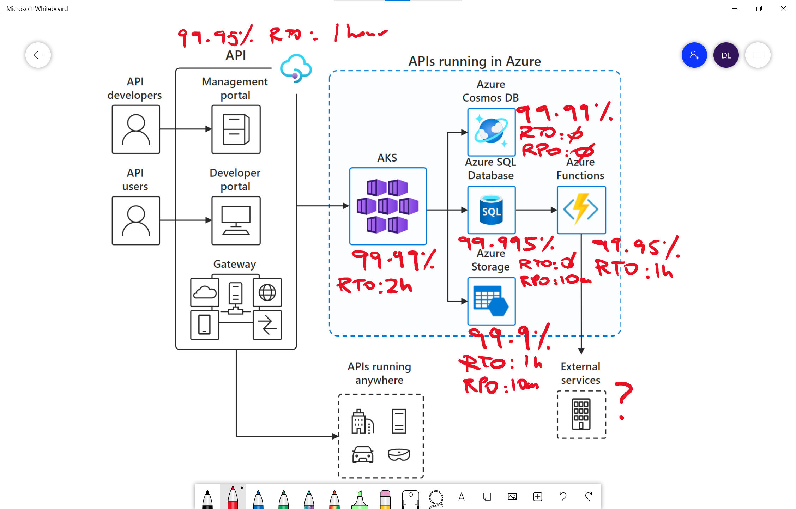

# Reliability

> **[prev]** | **[home]**  | **[next]**

Building a reliable application in the cloud is different from traditional application development. While historically you may have purchased levels of redundant higher-end hardware to minimize the chance of an entire application platform failing, in the cloud, we acknowledge up front that failures will happen. Instead of trying to prevent failures altogether, the goal is to minimize the effects of a single failing component.

## Well-architected framework

> 📖 Read [Overview of the reliability pillar]

> 📖 Complete the [guided learning path for reliability] on [Microsoft Learn]

The Reliability pillar contains a huge amount of valuable information for cloud architects and engineers. We have chosen a few themes from the pillar that we think are especially important.

## Shared responsibility

Under the _shared responsibility principle_, it is important to understand the responsibilities for reliability:

* Become familiar with [Azure Service-level Agreements] and the _failure modes_ of each service that is deployed
* Review [Azure subscription and service limits, quotas, and constraints]
* Enable the availability and recovery features that are appropriate to business requirements
* Avoid _single points of failure_
* Calculate the _composite uptime_ of the solution
* Follow best practices for each Azure service 
* Employ [cloud design patterns] for resilience and availability
* Keep Azure software libraries up to date, including frameworks and client SDKs

## High availability, business continuity & disaster recovery

Definitions for High availability (HA), Business Continuity and Disaster recovery (BC/DR) can vary from organisation to organisation and even from team to team. The [Well-architected framework] focuses on _reliability_ as an overarching theme.

Architecting for reliability ensures that your application can meet the commitments you make to your customers. This includes ensuring that your systems are _available_ to end users and can _recover_ from any failures.

## Uptime, RTO, RPO

Every application, service, platform and system has a stated or implied RTO, RPO and uptime. 

* **Uptime**: The target uptime for a system is usually measured as a percentage. For example, [99.9% uptime] equates to 43 minutes and 49 seconds of downtime per month. "Downtime" can be measured in various ways, but usually means that the service is not responding to repeated requests.
* **Recovery time objective (RTO)**: The maximum duration of acceptable downtime, where "downtime" is defined by your specification. For example, if the acceptable downtime duration is eight hours in the event of a disaster, then your RTO is eight hours.
* **Recovery point objective (RPO)**: The maximum duration of acceptable data loss. RPO is measured in units of time, not volume. Examples are "30 minutes of data," "four hours of data," and so on.

### Determine the SLA of your application

> 📖 Study [Determine the service-level agreement of your application] on Microsoft Learn

* Uptime, RTO and RPO are important business (non-functional) requirements 
* The business should be consulted when determining these requirements 
* There is a strong relationship between uptime, complexity and cost

## Architecture review

Once the target SLA requirements have been determined, an _Architecture review_ should be performed to ensure that these requirements are met. 

> 💡 [Microsoft FastTrack for Azure] can perform an architecture review of your solution on behalf of Microsoft Azure Engineering

> 🔨 Use the [Composite SLO Estimation spreadsheet] to calculate a system's composite SLO for uptime.

> 📖 FastTrack have published a [Solution review and guidance framework] for architecture reviews.

### Annotate the architecture diagram

Annotate the solution architecture diagram with SLA, RTO and RPO for each service. Single points of failure should be called out, and the composite uptime for the solution should be calculated by combining the uptime (SLA) for each service.

As an example, the [API-first SaaS business model] reference architecture (from [Azure Architecture Center]) has been annotated with uptime, RTO and RPO figures:

   _Figure: Annotated API-first SaaS business model reference architecture_

The uptime SLA's for each component in the _critical path_ of a solution should be multiplied together to calculate the _composite SLA_.

**Q. What is the composite uptime SLA for the solution above?** (From the point of view of an API user)

1. 99.99%?
1. 99.9%?
1. Less than 99.9%?

How could the uptime be improved?

## Improving availability and recovery times

Improving the availability and recovery times of a system can include several strategies including:

* Deploying services/features that offer higher availability and shorter recovery times
* Deploying across multiple Availability Zones (AZs) or Regions
* Writing _Run books_; standard operating procedures for the failure modes of the services that have been deployed. Often automated.
* Embracing _Degraded mode_: a special mode of operation that allows a system to remain available, albeit in a degraded state
* Documenting support processes, including having a clear line of sight to Azure Support with a suitable SLA for response time. Large mission critical systems should also invest in dedicated support resources in the vendor organisation.

### PaaS features for availability and recovery

Azure PaaS services provide _features_ for availability and recovery. Some features are only available in certain SKUs or Tiers (e.g. Premium). Some features are provided by [Zonal or zone-redundant architecture] in Availability Zones (AZ's).

Take time to research the availability and recovery features of each service. Enable the features + configuration + SKU/tier combination that meets your requirement. For example:

> ℹ This table is an example and not an exhaustive list of services and features

| Service | Availability features | Recovery features | Availability Zone (AZ) support |
| ------- | ----------- | ----------------- | ---------- |
| Azure API Management | <ul><li>99.95% uptime [SLA](https://azure.microsoft.com/en-au/support/legal/sla/api-management/v1_4/)</li><li>[Multi-region deployment](https://docs.microsoft.com/en-us/azure/api-management/api-management-howto-deploy-multi-region) (99.99% uptime)</li></ul> | [Backup & restore](https://docs.microsoft.com/en-us/azure/api-management/api-management-howto-disaster-recovery-backup-restore) | [Zone redundant](https://docs.microsoft.com/en-us/azure/api-management/zone-redundancy) |
| Azure Kubernetes Service (AKS) | <ul><li>VMSS (99.95% uptime [SLA](https://azure.microsoft.com/en-us/support/legal/sla/virtual-machines/v1_9/))</li><li>[AZ support for AKS Cluster](https://docs.microsoft.com/en-us/azure/aks/availability-zones) (99.99% uptime)</li></ul> | | Zonal |
| Azure App Services (and Functions) | <ul><li>99.95% uptime [SLA](https://azure.microsoft.com/en-au/support/legal/sla/app-service/v1_4/)</li><li>[Deployment (Swap) Slots]</li></ul> | [Scheduled backups](https://docs.microsoft.com/en-us/azure/app-service/manage-backup#configure-automated-backups) | [Zonal for ASE's](https://docs.microsoft.com/en-us/azure/app-service/environment/zone-redundancy) |
| Azure SQL DB | <ul><li>99.99% uptime [SLA](https://azure.microsoft.com/en-au/support/legal/sla/sql-database/v1_4/)</li><li>Zone redundant deployment (99.995% uptime)</li><li>[Active Geo replication](https://docs.microsoft.com/en-us/azure/azure-sql/database/active-geo-replication-overview)</li><li>[Failover groups](https://docs.microsoft.com/en-us/azure/azure-sql/database/auto-failover-group-overview?tabs=azure-powershell)</li></ul> | [Automated backups and Point in time restore](https://docs.microsoft.com/en-us/azure/azure-sql/database/automated-backups-overview?tabs=single-database) RPO: 10 minutes | Zone redundant |
| Azure Cosmos DB | <ul><li>99.99% uptime [SLA](https://azure.microsoft.com/en-us/support/legal/sla/cosmos-db/v1_3/)</li><li>[Multi-region](https://docs.microsoft.com/en-us/azure/cosmos-db/how-to-manage-database-account#addremove-regions-from-your-database-account), [Multi-write regions](https://docs.microsoft.com/en-us/azure/cosmos-db/how-to-manage-database-account#configure-multiple-write-regions) (99.999% uptime SLA)</li></ul> | [Automatic and online backups](https://docs.microsoft.com/en-us/azure/cosmos-db/online-backup-and-restore) RPO: 4 hours [Multi-region](https://docs.microsoft.com/en-us/azure/cosmos-db/how-to-manage-database-account#addremove-regions-from-your-database-account) RPO: 0 | [Zone redundant](https://docs.microsoft.com/en-us/azure/cosmos-db/high-availability#availability-zone-support) |
| Azure Storage | <ul><li>99.9% write, 99.99% read uptime [SLA](https://azure.microsoft.com/en-us/support/legal/sla/storage/v1_5/)</li><li>[LRS](https://docs.microsoft.com/en-us/azure/storage/common/storage-redundancy#locally-redundant-storage), [ZRS](https://docs.microsoft.com/en-us/azure/storage/common/storage-redundancy#zone-redundant-storage)</li><li>[RA-GRS, RA-GZRS](https://docs.microsoft.com/en-us/azure/storage/common/storage-redundancy#read-access-to-data-in-the-secondary-region)</li></ul> | [Geo-redundant storage (GRS, GZRS)](https://docs.microsoft.com/en-us/azure/storage/common/storage-redundancy#geo-redundant-storage)  RPO: 10 minutes | Zone redundant |

### Multi-AZ and Multi-region deployments

Most availability requirements can be met in a single Azure region with Availability Zones. For systems that require an extraordinary level of availability (or scalability) a multi-region deployment may be considered. 

> ℹ Contact **[Microsoft FastTrack for Azure]** for advice on multi region design and deployment.

### Run books and failure modes

It can be useful to consider three modes of operation for an I.T. system:

1. **Normal mode**. The system is operating normally.
2. **Degraded mode**. The system is degraded but is still responding to (some) requests.
3. **Failure mode**. The system is down (unavailable) and is not responding to repeated requests.

Failures can be _transient_ or _persistent_. Most failures in Azure are transient in nature and may not even be noticed by the client application. A transient failure for most PaaS services may last for up to 1 minute. After one minute the service would be considered to be down.

Teams that are practicing operational excellence will endeavour to write and rehearse Run books for each mode of operation, for each system/service they operate. Run books can be scripted for automated mitigation, also know as _self healing_.

For example, a team that operates a mission-critical system with a dependency on Azure SQL DB may have an ops run book for Normal mode, Degraded mode and Failure mode of that service:

    Azure SQL DB Run book for Service XYZ
    
    NORMAL MODE
    * Performance metrics are between (X) and (Y)
    * CPU is less than (Z)

    DEGRADED MODE
    * Observe DTU flatline at 100%
    * Response time in service A > (X)
    Procedure:
    1. Page on-call DBA
    2. Disable batch load scheduler
    3. Trigger "reports delayed" toast

    FAILURE MODE
    * Observe repeated connection failures for > 1 minute
    Procedure:
    1. Log Sev-A Support ticket
    2. Page on-call DBA
    3. Trigger "we're having problems" toast
    4. Load `FailoverRegion.ps1` script and standby for failover
    * Observe repeated connection failures for > 20 minutes with no view to resolution
    Procedure:
    1. Run failover script `FailoverRegion.ps1`: Failover to secondary region.
    (etc)

This example is written in a style that can be automated by a script (e.g. PowerShell) over time. Run books should be regularly tested and rehearsed.

## Resiliency patterns

Employ [resiliency patterns] at the application layer. [Cloud design patterns] like _retry_, _circuit breaker_, _failover_ and _queue based load leveling_ can have a significant positive impact on reliability.

> ### 🧩 Design pattern: Retry
> 
> Have applications transparently retry failed operations. Cloud environments are subject to a number
> of sources of transient failures, and simply retrying operations will frequently allow the operation
> to succeed.
> 
> 📖 Read the full [Retry pattern].

> ### 🧩 Design pattern: Circuit Breaker
> 
> Implement a component that detects failures in downstream services and encapsulates the logic
> required to detect them being online again, as well as notifying consumers of the service's current
> state.
> 
> 📖 Read the full [Circuit Breaker pattern].

> **[prev]** | **[home]**  | **[next]**

[prev]:./cloud-fundamentals.md
[home]:/README.md
[next]:/README.md
[Availability patterns]:https://docs.microsoft.com/en-us/azure/architecture/patterns/category/availability
[Resiliency patterns]:https://docs.microsoft.com/en-us/azure/architecture/patterns/category/resiliency
[Retry pattern]:https://docs.microsoft.com/en-us/azure/architecture/patterns/retry
[Circuit Breaker pattern]:https://docs.microsoft.com/en-us/azure/architecture/patterns/circuit-breaker
[cloud design patterns]:./azure-architecture-center.md#design-patterns
[Azure Architecture Center]:https://docs.microsoft.com/en-us/azure/architecture/
[guided learning path for reliability]:https://docs.microsoft.com/en-us/learn/modules/azure-well-architected-reliability/
[Microsoft Learn]:https://docs.microsoft.com/en-us/learn/
[99.9% uptime]:https://uptime.is/99.9
[Determine the service-level agreement of your application]:https://docs.microsoft.com/en-us/learn/modules/azure-well-architected-reliability/2-high-availability#determine-the-service-level-agreement-of-your-application
[Solution Review and Guidance Framework]:https://github.com/Azure/fta-architecturalreview/blob/master/articles/introduction.md
[Microsoft FastTrack for Azure]:https://azure.microsoft.com/en-us/programs/azure-fasttrack/
[Composite SLO Estimation spreadsheet]:/tools/Composite_SLO_Estimation_Tool.xlsx
[Zonal or zone-redundant architecture]:https://docs.microsoft.com/en-us/azure/architecture/high-availability/building-solutions-for-high-availability#zonal-vs-zone-redundant-architecture
[Deployment (Swap) Slots]:https://docs.microsoft.com/en-us/azure/app-service/deploy-staging-slots#swap-two-slots
[API-first SaaS business model]:https://docs.microsoft.com/en-us/azure/architecture/solution-ideas/articles/aks-api-first
[Overview of the reliability pillar]:https://docs.microsoft.com/en-us/azure/architecture/framework/resiliency/overview
[shared responsibility]:https://docs.microsoft.com/en-us/learn/modules/azure-well-architected-introduction/2-pillars#shared-responsibility
[Well-architected framework]:https://docs.microsoft.com/en-us/azure/architecture/framework
[Azure subscription and service limits, quotas, and constraints]:https://docs.microsoft.com/en-us/azure/azure-resource-manager/management/azure-subscription-service-limits
[Azure Service-level Agreements]:https://azure.microsoft.com/en-au/support/legal/sla/
